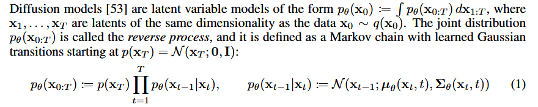
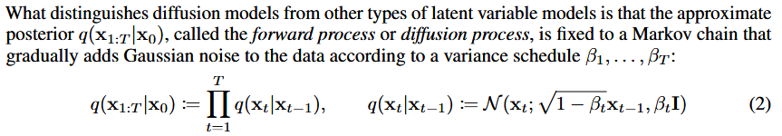
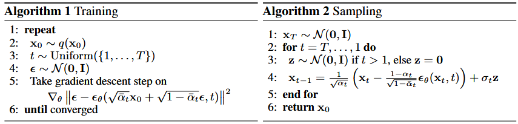
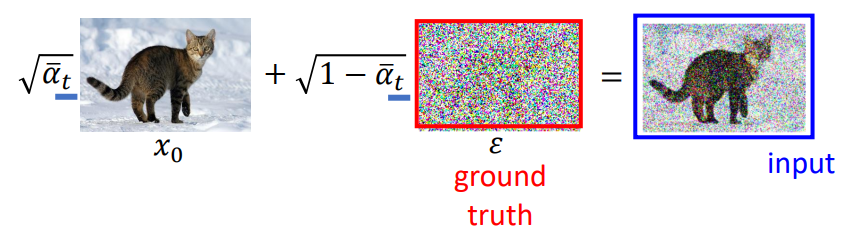
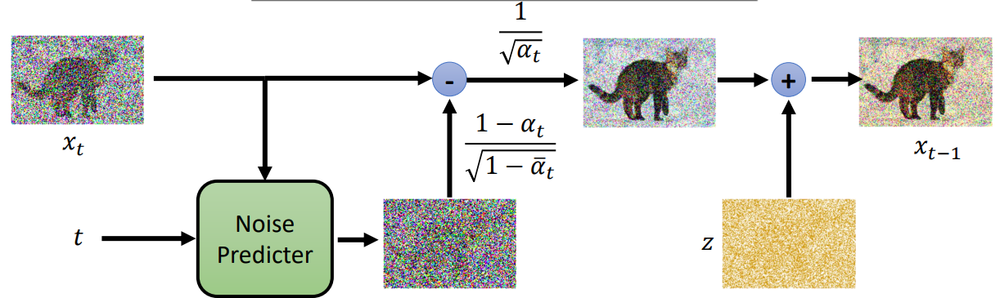

### 2. Background

#### 2.1 Reverse Process

**latent variable**

In machine learning and statistics, a latent variable refers to a variable that is **not directly observed or measured but is inferred** from other observable data. These variables capture underlying or hidden factors that can explain patterns in the data.

For example, in diffusion models, latent variables represent **noisy versions of the data at each time step in the reverse process**. They gradually transform from random noise (at the final time step T) back to a structure resembling the original data (at time step 0). This approach allows the model to learn a way to generate realistic samples by denoising these latent variables.

$x_1,...x_T$ 就是latent variable

---

**$x_0$~$q(x_0)$**

$x_0$ represents the original data point or sample (for example, an image or a piece of text).

$q(x_0)$ represents the true distribution of the data. This is an unknown distribution that we assume generates the observed data points.

The goal of diffusion models is to approximate this true distribution $q(x_0)$ by learning a model $p_θ(x_0)$ that can generate similar data points. The notation $x_0$∼$q(x_0)$ signifies that $x_0$ is a sample from the real-world distribution, which we use as ground truth in training the model.

$q_0$ 在生图过程中是我们喂给模型的训练资料，模型学习这些资料并Inference出与其风格相似的图片

---

**Markov Chain**

A Markov chain is a sequence of random variables (or states) where the probability of moving to the next state depends only on the current state, not on any past states. This property is called the Markov property, which makes the process memoryless.

**Memoryless Property**: The next state $s_{t+1}$ depends only on the current state $s_t$ (forward adding noise), not on any previous states $s_{t−1},s_{t−2}$…..Also applying to the Reverse Process.

The Markov chain structure allows diffusion models to efficiently approximate complex distributions by breaking down the data generation process into a series of simpler, conditional steps.

---

**Learned Gaussian Transition**

each step in the reverse process, $p_\theta(x_{t-1}|x_t)$ is modeled as a **Gaussian distribution**. This means that, given the noisy latent variable $x_t$ at time step t, the model assumes that the distribution of $x_{t-1}$ (one step closer to the original data) follows a **Gaussian distribution** centered around a mean $\mu_\theta(x_t,t)$ with a certain variance $\sum_\theta({x_t,t})$.(公式2)
$$
p_θ(x_{t−1}|x_t) := N (x_{t−1}; μ_θ(x_t, t), Σ_θ(x_t, t))
$$
$\mu_\theta(x_t,t)$: This function controls the direction and amount of denoising at each step. It is often designed to predict the “denoised” estimate of $x_{t−1}$ given $x_t$ at the time t.

$\sum_\theta({x_t,t})$: This term controls the uncertainty or randomness in each step. Higher variance allows more freedom in the denoising, while lower variance focuses the transition more narrowly around the mean.

**Why Each Step is Gaussian?**

+ **Reversing the Forward Noise**: In the forward process, we gradually add Gaussian noise to the original data to produce a highly noisy version $x_t$ at the final time step. Since each forward step adds Gaussian noise, it makes sense to reverse this process using Gaussian transitions in the reverse chain.
+ **Learnable Mean and Variance**: The parameters $\mu_\theta(x_t,t)$ and $\sum_\theta({x_t,t})$ are learned functions, typically implemented as neural networks. They are optimized during training so that each reverse step brings the distribution closer to the clean data distribution.

+ ...

#### 2.2 Forward Process(Diffusion Process)

**$q(x_t|x_{t-1}):=N(x_t;\sqrt{1-\beta_t}x_{t-1},\beta_tI)$**:

With enough steps, the cumulative effect of adding Gaussian noise drives $x_T$ to approximate a **standard Gaussian distribution($x_t$ ~ $N(0,I)$)**, regardless of the original data $x_0$. This is because adding Gaussian noise repeatedly pushes the distribution towards a Gaussian centered at zero (mean zero) with identity covariance. 

$q(x_t|x_0) = N (x_t;\sqrt{\overline{\alpha}_t}x_0,(1 − \alpha_t)I)$:

A notable property of the forward process is that it admits sampling $x_t$ at **an arbitrary timestep t** in closed form: using the notation $α_t := 1 − β_t$ and $\overline{\alpha}_t:=\prod_{s=1}^{t}\alpha_s$ .

这也是为什么在第3部分，Training过程中有：$\overline{\alpha}_tx_0+\sqrt{1-\overline{\alpha}_t}$，改变其均值和标准差

#### 2.3 How to Train

在Forward Process中没有可以训练的参数，只需要加上高斯噪音即可；在Reverse Process中，已知$x_T$~$N(0,I)$, 而 $x_{t-1}\sim N (x_{t−1}; μ_θ(x_t, t), Σ_θ(x_t, t))$, 其中$μ_θ(x_t, t);Σ_θ(x_t, t)$需要经过训练得到，为什么呢？

$P_\theta(x)=\int_zP(z)P_\theta(x|z)dz$：输入讯息z，经过模型得到结果G(z)，$G(z)=x$ 的概率，我们的目标是最大化这个概率。化简后得到右式，再化简得到下式，目标是**最小化**此式：

不用管Diffusion Process $L_T$, 要求最小化$L_{t-1}$即最小化 $q(x_{t-1}|x_t,x_0)$ 和 $p_\theta(x_{t-1}|x_t)$ 的KL divergence，前者已知$x_0$可以直接求 $x_{t-1}$ 的分布为：

有$x_{t-1}=\frac{\sqrt{\overline{\alpha}_{t-1}}\beta_tx_0+\sqrt{\alpha_t}(1-\overline{\alpha}_{t-1})x_t}{1-\overline{\alpha}_t}=\frac{1}{\sqrt{\alpha_t}}(x_t-\frac{1-\alpha_t}{\sqrt{1-\overline{\alpha}_t}}\epsilon)$. 解释了在推理过程中$x_{t-1}$是怎么计算的，而我们只需要预测这个 $\epsilon$ 即可。

### 3. Diffusion models and denoising autoencoders

**Training**
$$
\bigtriangledown_\theta||\epsilon-\epsilon_{\theta}(\overline{\alpha}_tx_0+\sqrt{1-\overline{\alpha}_t}\epsilon,t)||^2
$$

$\epsilon$: 在 forward process 中获得某个 step 的 noise

$\epsilon_\theta(x_t, step)$: 第一个参数为 forward process 中第 t 步产生的带 noise 的图片，即上图中的 input

$\overline{\alpha}_tx_0+\sqrt{1-\overline{\alpha}_t}\epsilon$: $x_0$到$x_t$可以一步到达，结果等价于 t 步加 noise 得到的结果

**Sampling/Reverse Inference**
$$
x_{t−1} = \frac{1}{\sqrt{\alpha_t}}  (  x_t − \frac{1−\alpha_t}{\sqrt{1-\overline{\alpha_t}}}\epsilon_\theta(x_t,t) )  + σ_tz
$$

